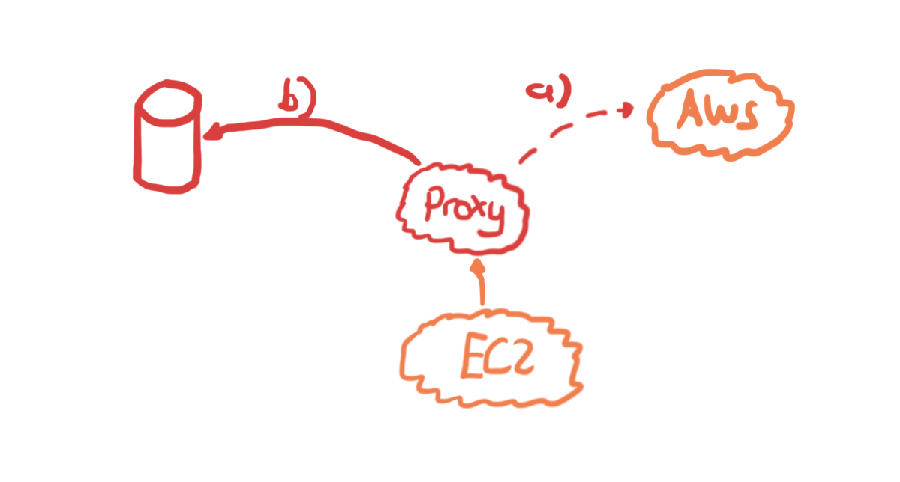

# Example for testing System Manager's Ansible with an HTTPS Proxy Recorder

## Introduction
As an continuation of the approach of using an http proxy for transparently redirecting URLs to the mocks, we make in this approach the mock (i.e., localstack) obsolete by recording real request and responses (a) that can be playback anytime (b) and from a developer PC. On one hand, there is no need to provide real infrastructure for them for each kind of testing. On the other hand, the testing can be reflect current AWS Services through regular renewal of the recordings.

## About Me

I am a full-blooded software engineer focused on AWS, Cloud, and building high-quality software. I like to learn programming languages and my belief is that multi-lingual language skills can help you to become a better programmer through learning from diverse language concepts. Further, I have interest in developing highly effective and efficient teams by discovering and expanding the team members' talents.

## Disclaimer

This example is just an illustration how you can combine a http proxy for testing ansible. It is not a blueprint for doing productive code or proper unit testing.

 
## Variants

* [HTTP Proxy with Local Stack](https://github.com/uwe-h/ansible_localstack_proxy)
* [Endpoint Urls](https://github.com/uwe-h/ansible_localstack)

## Implementation

### Http Proxy

* Based on mitmproxy
* Write routing files that forwards *.amazonaws.com to localstack
* Write specific S3 to Localstack logic (e.g., (test-bucket.s3.us-west-1.amazonaws.com --> localstack:4566/test-bucket)

### EC2 Simulation (EC2 Sim)

1. Set HTTPS proxy to your https proxy instance (`docker-compose.yml`)
1. AWS CLI (`Certificate Validation`) and other tools
    1. Copy mitmproxy root cert to `/usr/local/share/ca-certificates` in `ec2/Dockerfile`
    1. `update-ca-certificates`
    1. Use `REQUESTS_CA_BUNDLE` environment variable in `docker-compose.yml` (requests is a python module). AWS CLI comes with own python, so we used this environment parameter here.
1. AWS API with boto3 (`Certificate Validation`) in `ec2/Dockerfile`
    1. install with `pip` `certifi`
    1. Make the root certificate available for `certifi`

